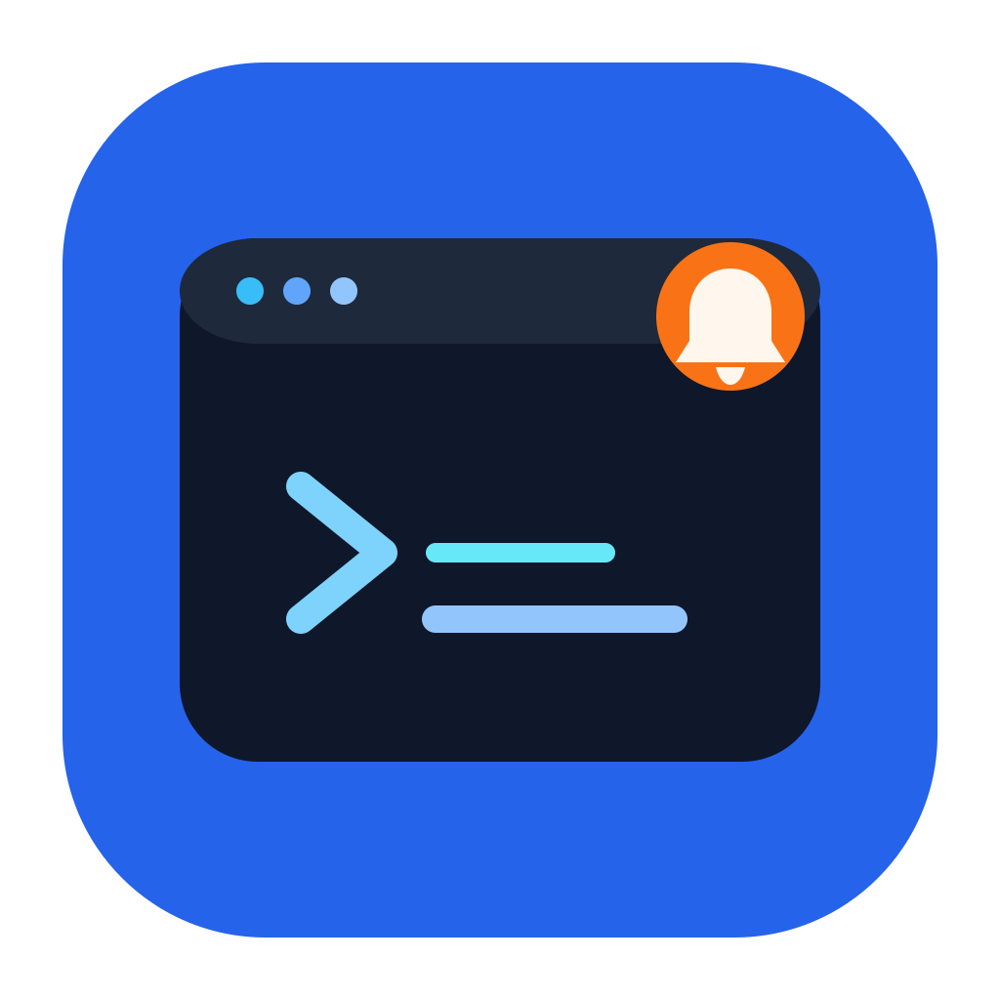

<p align="center">
  
</p>

# Agent Task Notifier

[中文](README.md) | [English](README.en.md)

An Agent notification extension for the integrated terminal in VS Code / Cursor.

Core goals:

- Keep using `codex` / `claude` / `opencode` in the terminal as usual.
- Automatically notify when one Agent task (turn / stop) completes.
- Click the notification to jump back to the terminal tab where the task started.

This extension is intentionally not a generic OSC notification plugin. It focuses only on the Agent workflow.

## Key Features

- Event flow design optimized for Codex + Claude + OpenCode.
- Structured event protocol: `OSC 777;notify;AGENT_TASK_EVENT_V1;<base64url-json>`.
- Supports both system notifications and VS Code toasts, with an action to jump back to the terminal.
- Uses deep links to return to the original VS Code window and the corresponding terminal tab.

## Quick Start

1. Install the extension.
2. Start `codex` once in the integrated terminal.
3. The extension will automatically check and rewrite `~/.codex/config.toml`:
   - Existing `notify` config entries are commented out (`# ...`).
   - Whenever `codex` startup is detected, the script is synced to `~/.codex/agent-task-notifier/notify.sh`.
   - Then `notify` is set to point to this external script.
4. Restart the current `codex` process when prompted.
5. Start `claude` once in the integrated terminal.
6. The extension automatically syncs Claude hook scripts to `~/.claude/agent-task-notifier/` and checks/rewrites `hooks.Stop` and `hooks.SubagentStop` in `~/.claude/settings.json`.
7. Restart the current `claude` process when prompted.
8. Start `opencode` once in the integrated terminal.
9. The extension automatically syncs OpenCode plugin scripts to `~/.opencode/plugins/`.
10. Restart the current `opencode` process when prompted.

## Agent Configuration

### Codex

No manual configuration is required by default. When the extension detects that you started `codex`, it automatically takes over `notify` and copies the script to `~/.codex/agent-task-notifier/notify.sh`.

To manually trigger a repair, run:

`Agent Task Notifier: Repair Codex Notify`

Note: Codex passes the `notify` event JSON as the first script argument.
The current adapter formats notification text as:
- Title: `Codex: <last-assistant-message>`
- Body: Short preview of `input-messages` (default: 120 chars, append `…` if truncated)

### Claude Code

No manual configuration is required by default. When the extension detects that you started `claude`, it automatically syncs scripts to `~/.claude/agent-task-notifier/` and writes hooks into `~/.claude/settings.json`.

To manually trigger a repair, run:

`Agent Task Notifier: Repair Claude Hooks`

If you prefer manual configuration, use a structure like this:

```json
{
  "hooks": {
    "Stop": [
      {
        "hooks": [
          {
            "type": "command",
            "command": "bash /absolute/path/to/vscode-agent-task-notifier/adapters/claude/stop-hook.sh"
          }
        ]
      }
    ],
    "SubagentStop": [
      {
        "hooks": [
          {
            "type": "command",
            "command": "bash /absolute/path/to/vscode-agent-task-notifier/adapters/claude/subagent-stop-hook.sh"
          }
        ]
      }
    ]
  }
}
```

### OpenCode

No manual configuration is required by default. When the extension detects that you started `opencode`, it automatically syncs plugin scripts to `~/.opencode/plugins/`:

- `agent-task-notifier.js`
- `agent-task-notifier-emit.sh`

To manually trigger a repair, run:

`Agent Task Notifier: Repair OpenCode Plugin`

Note: OpenCode integration uses plugin hooks. Current event mapping:
- `session.status` (`status.type=idle`) / `session.idle` -> `turn_complete`
- `permission.updated` / `permission.asked` -> `approval_requested`

## Settings

All settings are under `agentTaskNotifier.*`:

- `enabled`: Global on/off switch.
- `osNotification`: Enable system notifications.
- `vscodeToast`: Enable VS Code in-app notifications.
- `logLevel`: Log level (`error` / `warn` / `info` / `debug`).
- `dedupeWindowMs`: De-duplication window in milliseconds.
- `strictWindowRouting`: Strictly validate window token (prevents wrong-window jumps).

## Commands

- `Agent Task Notifier: Enable`
- `Agent Task Notifier: Disable`
- `Agent Task Notifier: Test Notification`
- `Agent Task Notifier: Show Logs`
- `Agent Task Notifier: Debug Status`
- `Agent Task Notifier: Repair Codex Notify`
- `Agent Task Notifier: Repair Claude Hooks`
- `Agent Task Notifier: Repair OpenCode Plugin`

## Debugging & Troubleshooting

### 1) Check extension logs first (most important)

1. Set `agentTaskNotifier.logLevel` to `debug` in settings.
2. Run `Agent Task Notifier: Show Logs` to open the Output panel.
3. Run `Agent Task Notifier: Debug Status` and confirm `shellIntegration=ready` for the current terminal.
4. Watch for these log keywords:
   - `Codex command detected ...`: Detected that you started codex in terminal.
   - `Codex notify config rewritten ...`: `~/.codex/config.toml` was auto-rewritten.
   - `Claude command detected ...`: Detected that you started claude in terminal.
   - `Claude hooks config rewritten ...`: `~/.claude/settings.json` was auto-rewritten.
   - `OpenCode command detected ...`: Detected that you started opencode in terminal.
   - `OpenCode plugin scripts synced ...`: Plugin scripts were synced to `~/.opencode/plugins/`.
   - `Structured event parsed ...`: Extension received a structured event.
   - `Structured payload detail ...`: Shows the `title/message` used by this notification (displayed with truncation).
   - `Suppressed duplicate event ...`: Event was suppressed by de-duplication.
   - `Notification delivered ...`: Notification was sent.
5. If you do not see `Started shell execution stream ...`, restart the corresponding `codex` / `claude` / `opencode` process after extension activation (only execution streams started after activation are observed).

### 2) Verify whether Codex actually emitted events

Add environment variables in the terminal where you start Codex:

```sh
export AGENT_TASK_NOTIFIER_DEBUG=1
export AGENT_TASK_NOTIFIER_LOG_FILE=/tmp/agent-task-notifier-codex.log
export AGENT_TASK_NOTIFIER_CODEX_MESSAGE_MAX_CHARS=120
```

Then run Codex and monitor in another terminal:

```sh
tail -f /tmp/agent-task-notifier-codex.log
```

If you see `received type=...` and `emitted event=...`, it means `notify.sh` was triggered and emitted events.

Additional note: the script writes events back in this order:

1. `/dev/tty`
2. Parent process TTY (`/dev/<tty>` from `ps -o tty= -p $PPID`)
3. `stdout + stderr` fallback

This helps it write back to the correct session even when the terminal tab is unfocused or `/dev/tty` is unavailable.

## Development

```sh
npm install
npm run watch
```

Then press `F5` in VS Code to launch Extension Development Host.

## Notes

- Adapter scripts rely on `jq` for JSON processing.
- Current versions support only the path where adapter scripts/hooks emit structured events.
- Codex/Claude config rewrite logic and OpenCode plugin sync are triggered only when startup of the corresponding command is detected.

## Acknowledgements

- [wbopan/vscode-terminal-osc-notifier](https://github.com/wbopan/vscode-terminal-osc-notifier)
